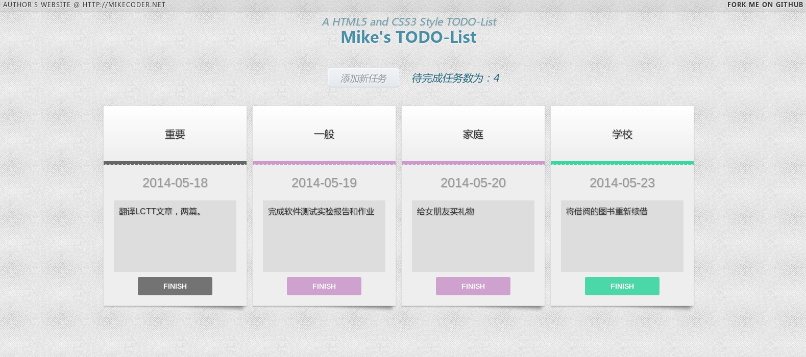
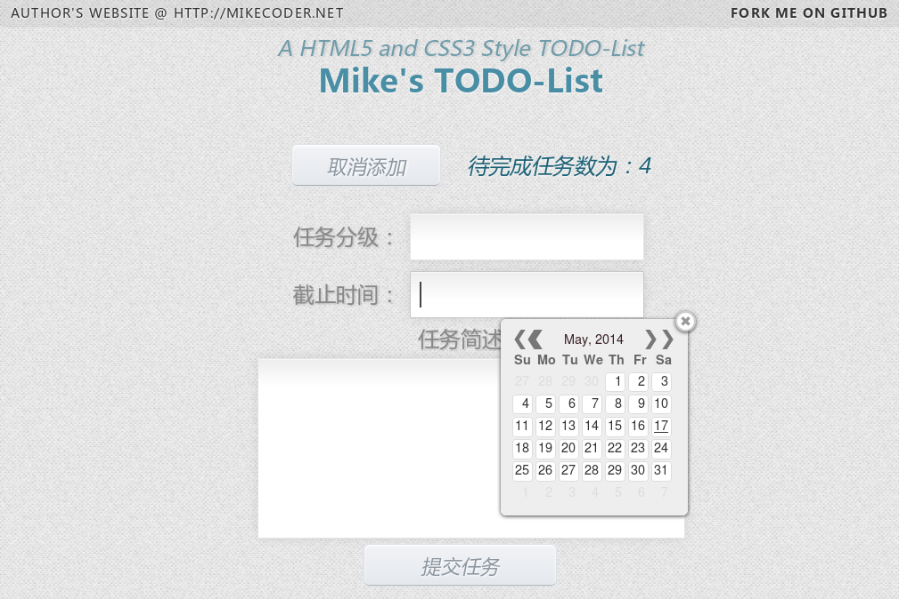
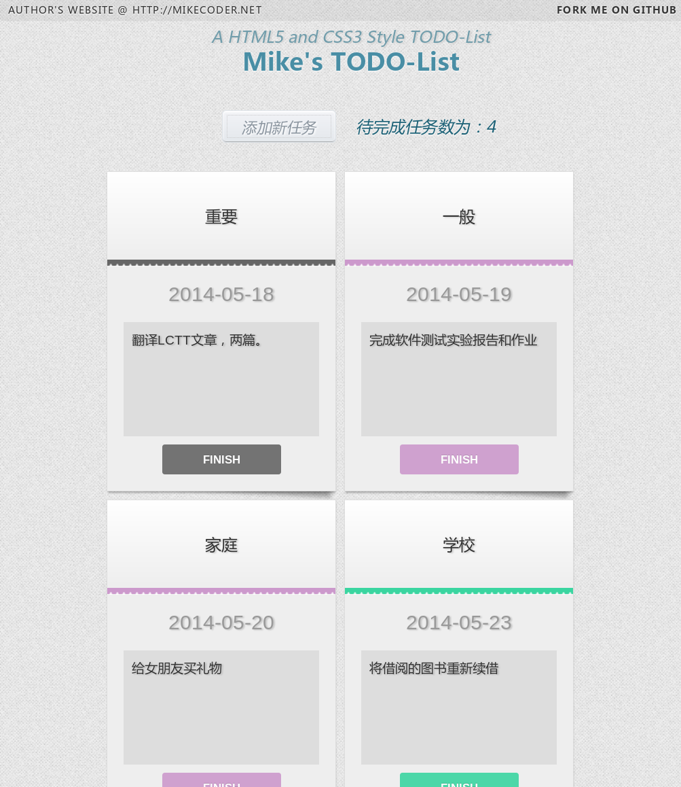
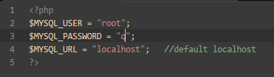

A simple HTML5 and CSS3 style TODO-List
---

It is created by my own and I just want to use it to make my own life more interesting.

Here is some features of the TODO-List:

#### Fresh View :
---
> 
>
> *This is the home page of this todo list, You can see all your tasks*
---
> 
>
> *This is your editor and you can use calendar to write your deadline*
---
> 
>
> *What's more? If you see this from your mobile, you see differently.It changes its layout to suit your screen size*

#### Easy to install :
---

**Following steps will lead you install this php project**

+ Clone from the github.
> `git clone https://github.com/MikeCoder/ToDoList.git`

+ cd into this folder.
> `cd ToDoList`

+ cd into the sql folder and run this sql script.
> `mysql -uusername -ppassword` to login your mysql server.
>
> `source init.sql(with full path)` to init your database.

+ find the file `config.php` and change the configuraton depend on your own Server.
> `vi config.php`
> 
> change these three to your own username, and your password.like this:
>
> 

+ Then copy this fold to your apache web root folder, if you are in Ubuntu, you can copy it into  `var/www/`.

+ Finally, open your browser, and goto [http://localhost/ToDoList](http://localhost/php/todolist/), you will see.

That's all. 
Thanks for your support!

>  Mike Tang written on 2014-05-16 at Soochow University